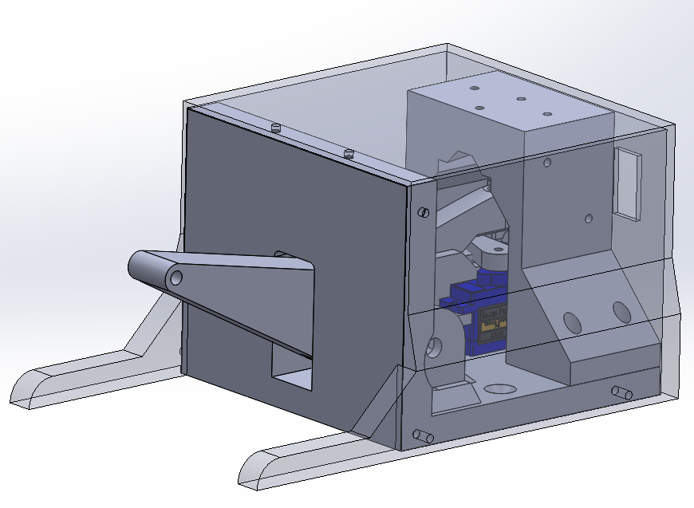

# PushyButton
 
PushyButton is a mechanical switch button with two programable stiffnesses. 
The device is composed of two lever arms capable of moving independently. 
The main lever arm enables the interface with the user (the user can push it down) and is constrained by a light spring on the other side.
The secondary lever arm is constrained by a stronger spring and has no interface with the user.
A small servo motor can engage or disengage a lock between the two lever arms thus locking the arms together.
When the lock is disengaged, the user push only again the light spring, but when the lock is engaged the user pushes against the two springs.

 